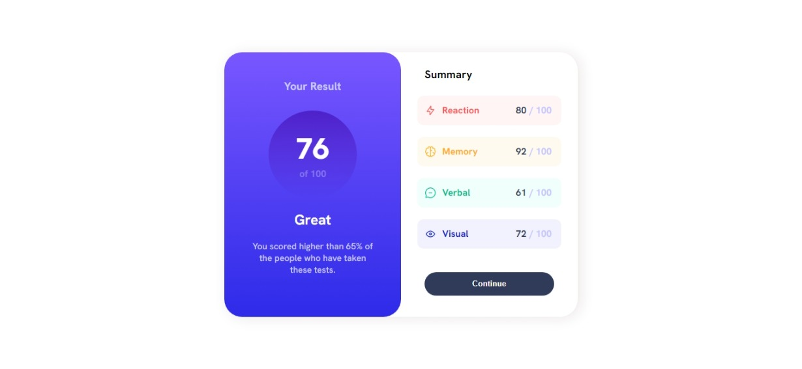

# Frontend Mentor - QR code component solution

This is a solution to the [Result Summary challenge on Frontend Mentor](https://www.frontendmentor.io/challenges/qr-code-component-iux_sIO_H). Frontend Mentor challenges help you improve your coding skills by building realistic projects. 

## Table of contents
- [Overview](#overview)
    - [Screenshot](#screenshot)
    - [Links](#links)
- [Process](#process)
    - [Tools used](#tools-used)
    - [What's new?](#whats-new)
- [Author](#author)
- [Acknowledgement](#acknowledgement)

## Overview
### Screenshot

### Links
- [Github repository](#)
- [Deployed site](#)

## Process
### Tools Used
- HTML5
- CSS
- Flexbox

### What's new?
I tried using the BEM naming convention to make reusable portions of my code.  

## Author
- Emmanuel Afrifa
- [emmaquame9@gmail.com](mailto:emmaquame9@gmail.com)
- [Frontend-Mentor](https://www.frontendmentor.io/profile/Emmanuel-Afrifa)
- [Twitter](https://twitter.com/Emma33712365)
- [Linkedin](https://www.linkedin.com/in/emmanuel-afrifa-840674214/)

## Acknowledgement
- [Frontend Mentor](https://www.frontendmentor.io/)
- [FreeCodeCamp Responsive Web Design](https://www.freecodecamp.org/learn/responsive-web-design/)